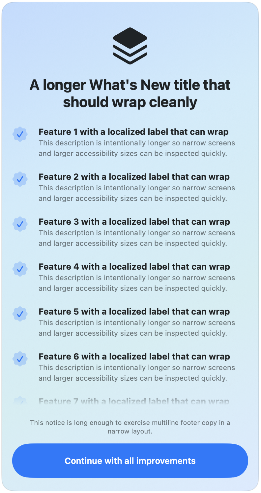
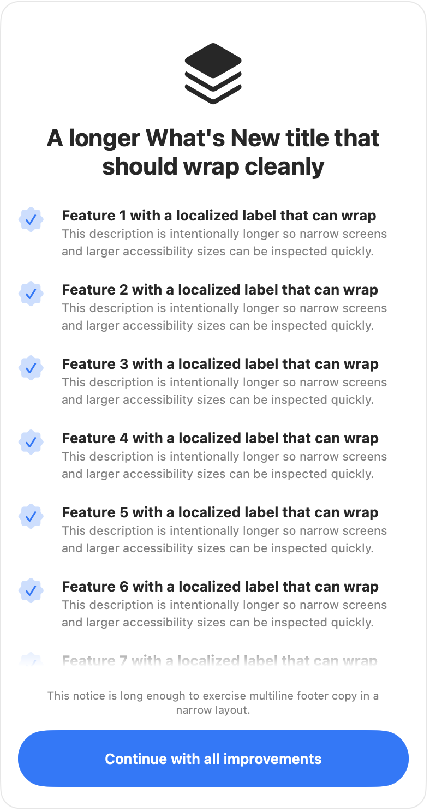

# ReleaseKit

A reusable SwiftUI "What's New" sheet for iOS and macOS apps in the HK Softworks portfolio.

The package and import name is `ReleaseKit`. Public view and content APIs intentionally use the
domain language `Release...`, for example `ReleaseView`, `ReleaseContent`, and
`ReleaseVersionTracker`.

## Preview

<p>
  
  
</p>

## Requirements

- iOS 26+ / macOS 26+
- Swift 6.2+

## Installation

No release tags are published yet, so use the `master` branch for now:

```swift
.package(url: "https://github.com/hksw-io/ReleaseKit.git", branch: "master")
```

Switch to a semantic version requirement after the first release tag exists:

```swift
.package(url: "https://github.com/hksw-io/ReleaseKit.git", from: "1.0.0")
```

Or in Xcode: **File > Add Package Dependencies**, enter the URL above, and select the `master` branch until a release tag is available.

## Usage

Implement `ReleaseContent` with your app's strings and icon, then present the view:

```swift
import SwiftUI
import ReleaseKit

struct MyRelease: ReleaseContent {
    var appIcon: Image? { Image("AppIconImage") }
    var title: Text { Text("What's New in MyApp") }
    var features: [ReleaseFeature] {
        [
            ReleaseFeature(
                id: "new-charts",
                systemImage: "chart.line.uptrend.xyaxis.circle",
                label: "New Charts",
                description: "Track your progress with redesigned charts."),
        ]
    }
    var notice: ReleaseNotice? {
        ReleaseNotice(text: Text("Plus many other improvements."))
    }
    var buttonText: Text { Text("Continue") }
}

struct RootView: View {
    @State private var isShowing = false

    var body: some View {
        ContentView()
            .sheet(isPresented: $isShowing) {
                ReleaseView(content: MyRelease()) {
                    isShowing = false
                }
            }
    }
}
```

## Backgrounds

The default background is the system sheet surface. Use `releaseBackground(_:)` when an app needs a more branded release note experience:

```swift
ReleaseView(content: MyRelease()) {
    isShowing = false
}
.releaseBackground(.animatedGradient())
.releaseStyle(ReleaseStyle(tint: .indigo))
```

Built-in options:

- `.system` — the default platform background.
- `.softGradient` / `.softGradient(brand:palette:)` — a restrained brand-derived background tuned for readable content.
- `.linearGradient(colors:startPoint:endPoint:)` — app-provided colors with the library-managed footer treatment.
- `.animatedGradient(brand:palette:motion:)` — an opt-in smooth full-surface animated gradient. It uses the style tint by default, adapts its tones for light and dark mode, and automatically becomes static when Reduce Motion is enabled.
- `.custom { context in ... }` — a fully custom SwiftUI background. Use `context.reduceMotion`, `context.brandColor`, and `context.colorScheme` to keep custom backgrounds consistent and accessible.

Every background spans behind the pinned footer and button area, including `.system`. Scroll indicators are hidden on supported platforms so branded sheets do not show a macOS scrollbar over the content.

`ReleaseStyle.tint` is the default brand color for `.softGradient` and `.animatedGradient()`. Pass `brand:` when the background should use a different brand color from the controls, or pass a full palette when an app needs exact light and dark tones:

```swift
let palette = ReleaseGradientPalette(
    light: .init(
        base: .white,
        primary: .pink,
        secondary: .orange,
        accent: .yellow),
    dark: .init(
        base: .black,
        primary: .pink,
        secondary: .purple,
        accent: .cyan))

ReleaseView(content: MyRelease()) {
    isShowing = false
}
.releaseBackground(.animatedGradient(palette: palette))
```

Use `motion:` when the default dancing gradient should be calmer or more expressive:

```swift
ReleaseView(content: MyRelease()) {
    isShowing = false
}
.releaseBackground(.animatedGradient(motion: .expressive))
```

The built-in presets are `.subtle`, `.standard`, and `.expressive`. Stronger motion increases movement, speed, and gradient contrast. For finer control, pass `ReleaseGradientMotion(strength:)`; values are clamped from `0` to `2`, and `0` keeps the animated-gradient color field static.

`.animatedMesh(primary:secondary:accent:)` remains available as a deprecated compatibility alias for `.animatedGradient(palette:motion:)`.

ReleaseKit keeps the footer pinned while content scrolls behind it. A measured footer mask fades overflowing content only above the footer; when scrolling reaches the end, visible content is fully opaque again.

## Styling

Use `releaseStyle(_:)` to override foreground, tint, and button colors while keeping the library's layout, typography, and motion:

```swift
ReleaseView(content: MyRelease()) {
    isShowing = false
}
.releaseStyle(ReleaseStyle(
    tint: .indigo,
    titleColor: .primary,
    featureIconColor: .mint,
    featureDescriptionColor: .secondary,
    noticeColor: .secondary,
    buttonForegroundColor: .white))
```

`ReleaseBackground` controls the surface behind the sheet content. `ReleaseStyle` controls foreground roles such as title, feature rows, notice text, and button text. Any color you leave as `nil` uses the standard system treatment. `tint` controls the prominent button accent and is also used by feature icons unless `featureIconColor` is set.

## Version tracking

Give every `ReleaseFeature` a stable `id`. Stable IDs let SwiftUI preserve row identity when features are inserted, removed, or reordered.

`ReleaseFeature` has `Text` and `LocalizedStringResource` initializers. Prefer the initializer with an explicit `id`; the old ID-less initializers remain only for compatibility and are deprecated.

`ReleaseVersionTracker` persists the last-shown version in `UserDefaults` and decides whether to present the sheet on launch:

```swift
let tracker = ReleaseVersionTracker(
    keyPrefix: "com.example.myapp",
    currentVersion: "1.2.0")

if tracker.shouldShowRelease() {
    // present ReleaseView
}

// after dismiss:
tracker.markAsShown()
```

The first launch after install is treated as "not new" — users see the sheet only on subsequent version upgrades.

## Local development

Run the package tests from the package root:

```sh
swift test
```

## License

MIT. See [LICENSE](LICENSE).
